# 🛡️ SuperSecretTip — TryHackMe Technical Walkthrough

**A professional penetration testing style walkthrough documenting source code disclosure, XOR secret reconstruction, Server-Side Template Injection (SSTI), Remote Code Execution (RCE), Linux privilege escalation, cron abuse, and secure remediation techniques.**


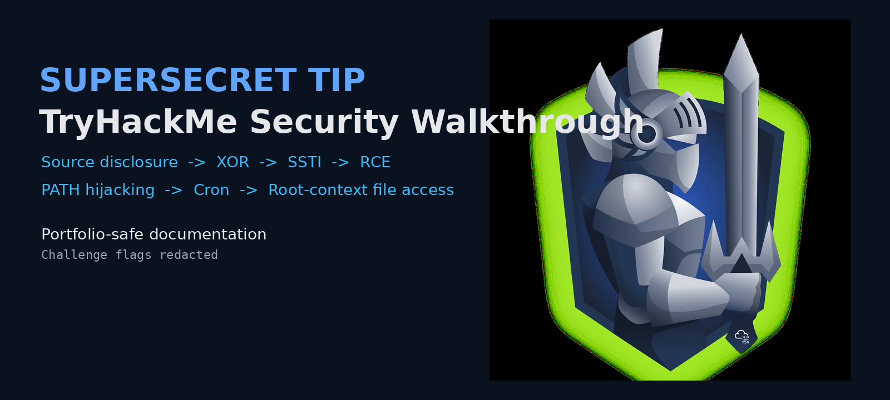

<div align="center">


### Cybersecurity Portfolio Walkthrough

*Prepared by **Anurag R.** for educational purposes and professional portfolio documentation.*

</div>

---

# 📑 Table of Contents

1. Executive Summary
2. Lab Overview
3. Objectives
4. Attack Path Overview
5. Technical Environment
6. Reconnaissance
7. Content Discovery
8. Source Code Analysis
9. Password Reconstruction (XOR)
10. Debug Authentication Workflow
11. Server-Side Template Injection
12. Remote Code Execution
13. Initial Shell Access
14. Linux Enumeration
15. Privilege Escalation — PATH Hijacking
16. Privilege Escalation — Root Cron Abuse
17. Vulnerability Analysis
18. MITRE ATT&CK Mapping
19. Security Lessons Learned
20. Detection & Defensive Recommendations

---

# 1️⃣ Executive Summary

## Engagement Overview

**SuperSecretTip** is a realistic **TryHackMe Capture The Flag (CTF)** room focused on exploiting vulnerabilities in a Python Flask web application and escalating privileges on a Linux host through multiple configuration weaknesses.

Unlike traditional CTF rooms that rely on guessing or brute force, this lab requires understanding application logic through exposed source code, identifying insecure cryptographic implementation, abusing a Server-Side Template Injection vulnerability, and chaining Linux privilege escalation techniques to compromise the system.

The room demonstrates how individually "minor" weaknesses become critical when chained together into a complete attack path.

---

## Assessment Highlights

| Phase                  | Result                                            |
| ---------------------- | ------------------------------------------------- |
| Network Enumeration    | Werkzeug web application discovered on TCP/7777   |
| Web Enumeration        | Hidden `/cloud` and `/debug` endpoints identified |
| Source Code Review     | Flask application source disclosed                |
| Cryptographic Analysis | XOR encryption reversed                           |
| Web Exploitation       | Server-Side Template Injection confirmed          |
| Command Execution      | Remote Code Execution achieved                    |
| Initial Access         | Interactive Linux shell obtained                  |
| Privilege Escalation   | PATH hijacking through writable `.profile`        |
| Root Compromise        | Cron configuration abuse using `curl -K`          |

---

## Skills Demonstrated

* Network reconnaissance
* Web application enumeration
* Burp Suite request manipulation
* Source code auditing
* Python security analysis
* XOR cryptography reversal
* Server-Side Template Injection (SSTI)
* Python runtime introspection
* Remote Code Execution
* Linux enumeration
* Cron job analysis
* PATH hijacking
* Secure configuration review
* Vulnerability reporting

---

## Public Portfolio Notice

> **Challenge flags, cookies, passwords, API keys, session tokens, and sensitive values have been intentionally redacted.**

This repository is designed to demonstrate methodology and technical reasoning rather than disclose challenge answers.

Throughout this report:

```text
FLAG_REDACTED
PASSWORD_REDACTED
COOKIE_REDACTED
SECRET_REDACTED
```

replace sensitive values.

---

# 2️⃣ Lab Overview

## Room Information

<table>
<tr><td><strong>Platform</strong></td><td>TryHackMe</td></tr>
<tr><td><strong>Room</strong></td><td>SuperSecretTip</td></tr>
<tr><td><strong>Operating System</strong></td><td>Linux</td></tr>
<tr><td><strong>Primary Stack</strong></td><td>Python • Flask • Werkzeug</td></tr>
<tr><td><strong>Category</strong></td><td>Web Exploitation + Privilege Escalation</td></tr>
<tr><td><strong>Difficulty</strong></td><td>Medium</td></tr>
</table>

---

## Scenario

The target hosts a Flask web application running on a Werkzeug development server.

Initial enumeration reveals a limited attack surface, but hidden functionality exposes internal source files, debug mechanisms, and insecure authentication logic.

The objective is to understand the application internally before exploiting it.

---

## Learning Goals

By completing this room, the learner gains experience with:

* Flask application internals.
* Source code disclosure.
* Weak cryptographic implementation.
* Jinja2 template injection.
* Linux privilege escalation via scheduled tasks.
* Secure coding analysis.

---

# 3️⃣ Objectives

## Primary Objective

Compromise the vulnerable Linux machine through authorized exploitation techniques and document each stage professionally.

---

## Technical Goals

* Enumerate services.
* Discover hidden endpoints.
* Analyze application source code.
* Recover authentication secret.
* Authenticate to debug functionality.
* Confirm SSTI.
* Execute operating system commands.
* Obtain shell access.
* Escalate privileges.
* Retrieve root access ethically within the lab.

---

## Documentation Goals

This report emphasizes:

* Technical explanation.
* Security reasoning.
* Evidence-based methodology.
* Defensive recommendations.

---

# 4️⃣ Attack Path Overview

The room follows a complete exploitation chain.

## High-Level Attack Diagram

```text
                   INTERNET
                       │
                       ▼
          Python Flask Application
           Werkzeug HTTP Server
                  TCP/7777
                       │
          ┌────────────┴─────────────┐
          │                          │
      /cloud                     /debug
          │                          │
          ▼                          ▼
  Source Code Disclosure      Debug Authentication
          │                          │
          └────────────┬─────────────┘
                       ▼
             XOR Secret Recovery
                       ▼
            Authenticated Session
                       ▼
          Server-Side Template Injection
                       ▼
             Remote Code Execution
                       ▼
               Linux User Shell
                       ▼
             Cron Enumeration
                       ▼
            Writable .profile Abuse
                       ▼
               PATH Hijacking
                       ▼
               Second User Shell
                       ▼
         Root Cron Configuration Abuse
                       ▼
               Root-Level Access
```

---

## Vulnerability Chain

<table>
<tr>
<th>Stage</th>
<th>Weakness</th>
</tr>

<tr>
<td>1</td>
<td>Source code disclosure.</td>
</tr>

<tr>
<td>2</td>
<td>Weak XOR-based secret protection.</td>
</tr>

<tr>
<td>3</td>
<td>Client-controlled localhost trust.</td>
</tr>

<tr>
<td>4</td>
<td>Server-Side Template Injection.</td>
</tr>

<tr>
<td>5</td>
<td>Python command execution.</td>
</tr>

<tr>
<td>6</td>
<td>Writable shell initialization file.</td>
</tr>

<tr>
<td>7</td>
<td>Root cron reads writable curl configuration.</td>
</tr>

</table>

---

## Security Perspective

Each vulnerability individually appears manageable.

However, chaining them results in:

* Authentication bypass.
* Code execution.
* Lateral movement.
* Root compromise.

This demonstrates the importance of **Defense in Depth**.

---

# 5️⃣ Technical Environment

## Target Environment

<table>
<tr><td><strong>Application Framework</strong></td><td>Flask</td></tr>
<tr><td><strong>Template Engine</strong></td><td>Jinja2</td></tr>
<tr><td><strong>Web Server</strong></td><td>Werkzeug Development Server</td></tr>
<tr><td><strong>Language</strong></td><td>Python 3.11</td></tr>
<tr><td><strong>Operating System</strong></td><td>Ubuntu Linux</td></tr>
</table>

---

## Tools Used During Assessment

| Tool       | Purpose                            |
| ---------- | ---------------------------------- |
| Nmap       | Network reconnaissance             |
| FFUF       | Directory enumeration              |
| Burp Suite | HTTP interception & manipulation   |
| Python     | XOR analysis & payload generation  |
| Netcat     | Reverse shell listener             |
| pspy64     | Process monitoring                 |
| Linux CLI  | Enumeration & privilege escalation |

---

## Attack Surface Summary

<table>
<tr>
<th>Surface</th>
<th>Description</th>
</tr>

<tr>
<td>SSH</td>
<td>Remote management service.</td>
</tr>

<tr>
<td>HTTP</td>
<td>Flask application running on TCP/7777.</td>
</tr>

<tr>
<td>Debug Interface</td>
<td>Authentication-protected internal functionality.</td>
</tr>

<tr>
<td>Download Feature</td>
<td>Weak validation exposing internal files.</td>
</tr>

<tr>
<td>Cron Jobs</td>
<td>Privileged scheduled tasks.</td>
</tr>

</table>

---

## Threat Model

### Entry Point

The attacker has **network access** only.

### Trust Boundary Violations

* User input reaches template engine.
* Client headers influence authorization.
* Source files exposed publicly.
* Root process consumes attacker-controlled configuration.

---

## Expected Kill Chain

| Phase                | Goal                         |
| -------------------- | ---------------------------- |
| Discovery            | Identify exposed services.   |
| Enumeration          | Locate hidden functionality. |
| Analysis             | Recover internal logic.      |
| Exploitation         | Execute server-side code.    |
| Persistence (Lab)    | Interactive shell.           |
| Privilege Escalation | Root-level compromise.       |

---

## Evidence Collection Standard

Every screenshot is stored inside:

```text
docs/assets/
```

and referenced consistently throughout the documentation.

| Screenshot Prefix | Meaning                          |
| ----------------- | -------------------------------- |
| `00`              | Room Banner                      |
| `01–05`           | Reconnaissance & Source Analysis |
| `06–13`           | SSTI & RCE                       |
| `14–18`           | Linux Privilege Escalation       |

---

---

# 6️⃣ Phase One — Reconnaissance & Attack Surface Enumeration

Reconnaissance is the first stage of every penetration test. Before interacting with application logic, the objective is to identify exposed services, determine the technologies running on the target host, and discover potential attack vectors.

The SuperSecretTip room intentionally exposes a minimal attack surface, making enumeration an essential step before exploitation.

---

## 6.1 Initial Network Enumeration

A full TCP scan was performed against the target machine to identify open ports and running services.

```bash
nmap -sV -p- -T4 TARGET_IP
```

### Screenshot — Initial Port Scan

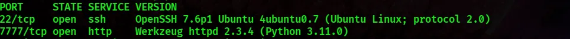

---

### Enumeration Results

| Port         | Service | Version              | Observation                           |
| ------------ | ------- | -------------------- | ------------------------------------- |
| **22/tcp**   | SSH     | OpenSSH              | Linux remote administration service.  |
| **7777/tcp** | HTTP    | Werkzeug HTTP Server | Python Flask development application. |

---

### Technical Analysis

The scan immediately indicates a **Python development environment**.

Important observations:

* Werkzeug is commonly used during Flask development.
* Development servers frequently expose debugging functionality.
* Non-standard HTTP ports often host internal or experimental applications.

### Why Port 7777 Matters

Unlike production web servers (80/443), development ports often expose:

* Debug routes.
* Source files.
* Testing endpoints.
* Weak authentication mechanisms.

This immediately increases the priority of web enumeration.

---

## Security Observation

> Development infrastructure should never be directly exposed to untrusted networks.

Production deployments should use:

* Gunicorn
* uWSGI
* Nginx
* Apache reverse proxy

rather than Werkzeug's development server.

---

# 7️⃣ Web Content Discovery

After identifying the HTTP service, the next objective was discovering hidden resources.

The landing page exposed very little functionality, suggesting additional endpoints existed.

---

## 7.1 Directory Enumeration

A wordlist-based directory discovery attack was executed using **FFUF**.

```bash
ffuf \
-w /usr/share/wordlists/seclists/Discovery/Web-Content/raft-medium-directories.txt \
-u http://TARGET_IP:7777/FUZZ \
-fc 403 -c
```

### Screenshot — FFUF Enumeration

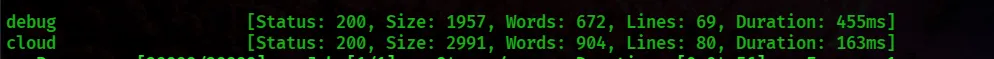

---

## Enumeration Findings

Two hidden directories were discovered.

| Endpoint | Status   | Initial Assessment                        |
| -------- | -------- | ----------------------------------------- |
| `/cloud` | HTTP 200 | File download functionality.              |
| `/debug` | HTTP 200 | Debug interface requiring authentication. |

---

## Why These Endpoints Are Interesting

### `/cloud`

Immediately suggests:

* File storage.
* Download capability.
* Static resources.
* Potential file traversal opportunities.

### `/debug`

Potential attack vectors include:

* Administrative debugging.
* Internal diagnostics.
* Developer-only functionality.

Debug endpoints should never be publicly reachable.

---

## Attack Surface Expansion

At this point the application exposes:

```text
Web Application
│
├── /
│
├── /cloud
│
└── /debug
```

The next stage focuses on understanding `/cloud`.

---

## Security Note

Content discovery remains one of the highest value reconnaissance techniques because hidden functionality frequently contains:

* administrative panels,
* development tools,
* backup files,
* undocumented APIs,
* debugging interfaces.

---

# 8️⃣ Source Code Disclosure Analysis

The `/cloud` endpoint became the most promising attack surface.

Instead of serving static content securely, it accepted user-controlled filenames.

---

## 8.1 Investigating Download Functionality

The endpoint accepted a filename parameter and returned downloadable files.

A manual request was intercepted with **Burp Suite** for further analysis.

### Screenshot — Source Request Through Burp Suite

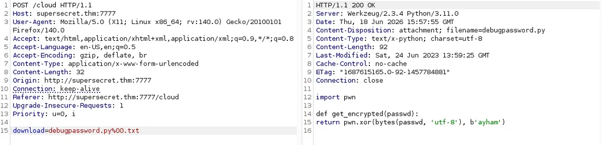

---

### Initial Observations

The endpoint attempted to validate filenames based on extension.

The validation logic only inspected the **last four characters** of the filename.

Example logic:

```python
filename[-4:] == ".txt"
```

This is an example of **weak suffix validation**.

---

## Why Suffix Validation Is Dangerous

Checking only the last characters of a filename ignores:

* null-byte edge cases,
* alternate extensions,
* encoded characters,
* path normalization.

Attackers often exploit weak filename validation to retrieve unintended files.

---

## Source Disclosure Impact

Application source files became accessible through the download endpoint.

Recovered files revealed:

* Flask routes.
* Authentication workflow.
* Helper modules.
* Encryption routine.
* Hidden endpoints.

The assessment transitioned from **black-box testing** into **white-box application analysis**.

---

## White-Box Advantage

Source disclosure provides attackers with:

| Information          | Benefit                       |
| -------------------- | ----------------------------- |
| Routes               | Hidden attack surface.        |
| Imports              | Internal helper modules.      |
| Authentication logic | Understand security controls. |
| Comments             | Reveal unfinished features.   |
| Secrets              | Recover credentials or keys.  |

---

## Security Impact

Source disclosure increases attacker capability dramatically because:

* vulnerabilities become easier to identify,
* hidden functionality becomes visible,
* authentication mechanisms become understandable.

---

## Defensive Recommendation

Never expose:

* application source,
* configuration files,
* helper modules,
* backup archives,
* development artifacts.

---

# 9️⃣ Flask Application Architecture Review

Reading the recovered source code revealed how the application processed authentication and debugging requests.

Instead of blindly attacking endpoints, the application workflow could now be reconstructed.

---

## High-Level Application Flow

```text
Client Request
      │
      ▼
 Flask Application
      │
 ┌────┴─────────┐
 │              │
 │         /cloud
 │              │
 │        File Download
 │
 ▼
 /debug
 │
 │ Password Validation
 │
 ▼
 Session Created
 │
 ▼
 /debugresult
 │
 ▼
 Template Rendering
```

---

## Hidden Components

The recovered source referenced helper modules responsible for:

* password encryption,
* localhost validation,
* debug authentication.

This indicated security functionality had been separated into Python modules.

---

## Why This Matters

Attackers no longer need to guess.

Instead they can:

* understand validation logic,
* inspect cryptography,
* discover hidden routes,
* reproduce server behavior locally.

---

## Secure Design Principle Violated

**Security through obscurity.**

The application relied on hidden logic instead of enforcing secure controls.

---

# 🔟 Weak Cryptography — XOR Secret Reconstruction

One of the helper modules implemented a custom XOR-based encryption routine.

The `/debug` endpoint encrypted user input before comparing it against stored ciphertext.

This meant authentication depended on a reversible transformation.

---

## 10.1 Retrieving Encrypted Secret

The encrypted value was downloaded through the vulnerable endpoint.

### Screenshot — Encrypted Secret Retrieval

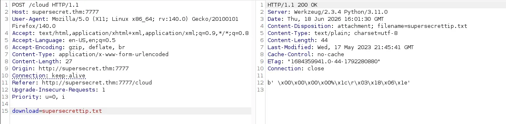

The downloaded file contained encrypted bytes rather than plaintext credentials.

---

## 10.2 Understanding XOR Encryption

The helper function implemented XOR using a fixed key.

### XOR Concept

```text
Plaintext XOR Key = Ciphertext

Ciphertext XOR Key = Plaintext
```

The same operation encrypts and decrypts data.

---

## XOR Visualization

```text
Plaintext
10101010

Key
00111100

XOR
10010110
```

Running XOR again with the same key restores the original plaintext.

---

## Why XOR Failed Here

The implementation had multiple weaknesses.

| Weakness                   | Security Impact                      |
| -------------------------- | ------------------------------------ |
| Fixed key                  | Reusable forever.                    |
| Stored in application code | Recoverable after source disclosure. |
| No salt                    | Deterministic output.                |
| Reversible                 | Not password hashing.                |

---

## Security Lesson

Passwords should never be protected using reversible encryption.

Instead:

| Use Case         | Recommended |
| ---------------- | ----------- |
| Password Storage | Argon2id    |
| Password Storage | bcrypt      |
| Password Storage | scrypt      |
| Encryption       | AES-GCM     |

---

# 11️⃣ Reverse Engineering the Password Logic

Instead of guessing the debug password, the recovered helper function was reproduced locally.

---

## 11.1 Local Analysis

The helper routine XORed supplied input against a static byte sequence.

Because both the ciphertext and algorithm were available, reversing the password became trivial.

### Screenshot — XOR Reconstruction

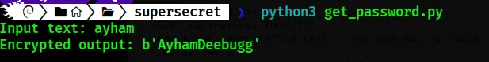

---

## Reverse Engineering Workflow

```text
Recovered Ciphertext
         │
         ▼
Recovered XOR Routine
         │
         ▼
Recovered Static Key
         │
         ▼
Apply XOR Again
         │
         ▼
Recovered Plaintext Password
```

---

## Why This Is Reverse Engineering

The attacker is not breaking cryptography mathematically.

Instead they are reproducing application logic exactly as the server performs it.

This is a common penetration testing technique when source code is exposed.

---

## Authentication Result

The recovered plaintext password successfully authenticated to the `/debug` endpoint.

The application generated a valid authenticated session.

> **Password value intentionally redacted in this public documentation.**

```text
PASSWORD_REDACTED
```

---

## Security Analysis

This authentication design violates several security principles:

* Reversible password storage.
* Embedded encryption key.
* Source code contains authentication implementation.
* Secrets and logic stored together.

---

## Blue Team Detection Opportunity

Monitor for:

* repeated requests for source files,
* downloads of helper modules,
* unusual access to internal application resources,
* enumeration of hidden development endpoints.

---

## Security Lessons Learned

* Never expose application source code through download functionality.
* Validation based only on filename suffixes is insufficient.
* Custom cryptography is rarely secure.
* Reversible encryption should never protect passwords.
* Source disclosure dramatically increases attacker capability.

---


---

# 1️⃣2️⃣ Phase Two — Debug Authentication & Trust Boundary Analysis

After recovering the application's authentication secret through source code analysis, the next objective was to understand how the Flask application authorized access to its internal debugging functionality.

Rather than exposing debugging information directly, the application implemented an authentication workflow combined with a localhost restriction. Understanding this workflow was essential before exploitation.

---

## 12.1 Understanding the Debug Workflow

The recovered Flask source revealed two important routes:

| Route          | Purpose                                        |
| -------------- | ---------------------------------------------- |
| `/debug`       | Validates a password and creates a session.    |
| `/debugresult` | Displays debug output for authenticated users. |

Instead of rendering debug information immediately, the application established an authenticated session and redirected the user to an internal endpoint.

This separation created an additional authorization layer.

---

## Authentication Flow

```text id="ytn1b4"
User
 │
 │ Password
 ▼
/debug
 │
 │ Authentication
 ▼
Session Created
 │
 ▼
/debugresult
 │
 ▼
Debug Information Rendered
```

---

### Security Observation

At first glance, this appears to be a reasonable design:

* Password validation.
* Session creation.
* Internal debug endpoint.

However, the authorization boundary relied on an insecure trust decision.

---

## 12.2 Debug Helper Module Analysis

The source code referenced an internal helper responsible for determining whether requests originated from localhost.

### Screenshot — Debug Source Analysis

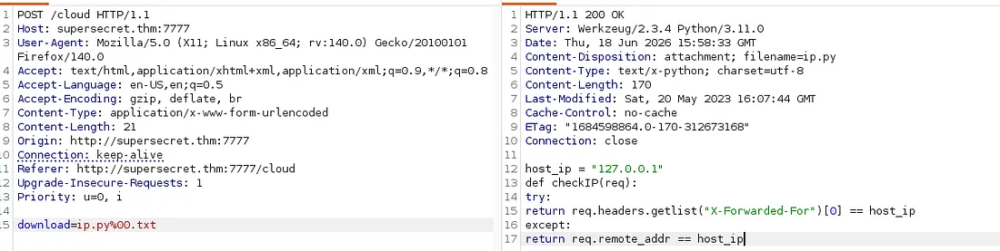

The helper checked whether the client appeared to be **127.0.0.1** before allowing access to the debug output.

---

## Why This Matters

Many internal applications expose privileged functionality only to localhost.

Examples include:

* Debug dashboards.
* Health endpoints.
* Metrics.
* Administrative consoles.

The assumption is that only trusted local software can reach these routes.

The weakness appears when **client-controlled data** is used to determine locality.

---

# 1️⃣3️⃣ Localhost Trust Boundary Bypass

The application attempted to distinguish local requests from external requests using an HTTP header rather than a trusted proxy.

This is a classic **trust boundary violation**.

---

## 13.1 Forwarded Header Analysis

The helper trusted a forwarding header supplied by the client.

Instead of validating the true network source, the application accepted forwarded metadata.

### Trust Decision

```text id="8ghgxg"
Incoming Request
        │
        ▼
Forwarded Header
        │
        ▼
Application Trust Decision
        │
        ▼
Localhost Access Granted
```

---

## Security Weakness

The application trusted information originating from the attacker.

Examples of client-controlled forwarding headers include:

* X-Forwarded-For
* X-Real-IP
* Forwarded

Without a trusted reverse proxy, these headers can be spoofed.

---

## 13.2 Request Manipulation

The request was intercepted inside Burp Suite.

The forwarding header was modified before forwarding it to the application.

### Screenshot — Authenticated Debug Request

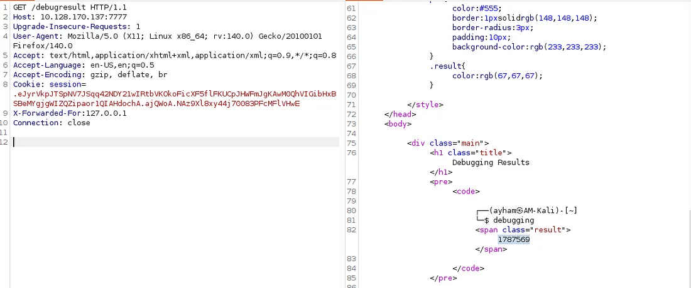

The authenticated session cookie generated by `/debug` was reused for `/debugresult`.

> Session values are intentionally omitted from this documentation.

```text id="2bujuk"
COOKIE_REDACTED
```

---

## Why the Session Was Required

The application enforced **two separate requirements**:

1. Valid authenticated session.
2. Request appears to originate from localhost.

Both conditions had to be satisfied.

---

## Authorization Bypass Analysis

| Control              | Status                                           |
| -------------------- | ------------------------------------------------ |
| Password             | Legitimately satisfied through recovered secret. |
| Session Cookie       | Generated after authentication.                  |
| Localhost Validation | Bypassed through forwarded header trust.         |

---

## Trust Boundary Lesson

This vulnerability is **not** an authentication bypass.

Authentication still occurred correctly.

Instead, it is an **authorization bypass** caused by trusting attacker-controlled metadata.

---

## Secure Design Recommendation

Applications should:

* Trust forwarding headers only from known reverse proxies.
* Strip externally supplied forwarding headers.
* Validate the actual remote address whenever possible.

---

# 1️⃣4️⃣ Server-Side Template Injection (SSTI)

With the authenticated debug session established, attention shifted to the application's template rendering logic.

This became the primary Remote Code Execution vector.

---

## 14.1 What is SSTI?

**Server-Side Template Injection** occurs when user-controlled input is evaluated as template code rather than displayed as data.

### Jinja2 Processing

```text id="3ezzdg"
User Input
      │
      ▼
Jinja Template Engine
      │
      ▼
Python Evaluation
      │
      ▼
Rendered Response
```

---

### Why Jinja2 Is Powerful

Jinja templates can access:

* Variables.
* Objects.
* Classes.
* Functions.
* Python runtime objects.

Improper rendering exposes application internals.

---

## 14.2 Vulnerable Pattern

The source code rendered debug input directly through a template rendering function instead of treating it as plain text.

This meant user input entered the Jinja interpreter.

---

## Security Consequences

Potential attacker capabilities include:

* Read application variables.
* Inspect configuration.
* Enumerate classes.
* Execute Python expressions.
* Execute operating system commands.

---

## 14.3 Confirming SSTI Safely

Before attempting code execution, harmless arithmetic confirmed template execution.

### Screenshot — SSTI Confirmation

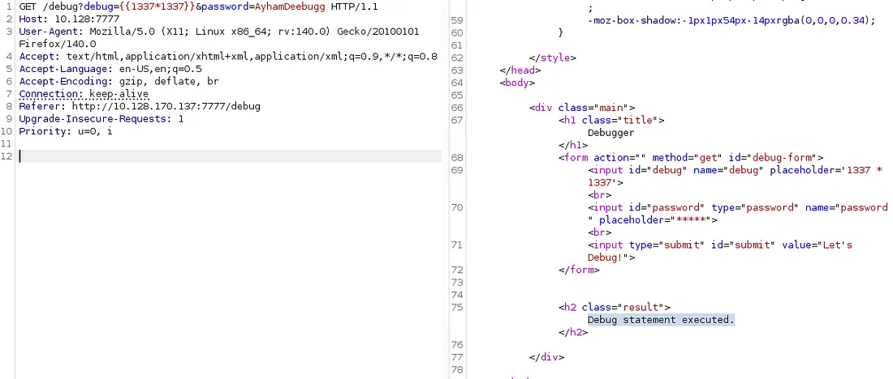

A simple mathematical expression evaluated successfully inside the template.

---

## Why Arithmetic Testing Matters

Safe validation confirms:

* Template parsing.
* Expression evaluation.
* Rendering behavior.

without executing operating system commands.

---

## Detection Opportunity

Indicators include:

* Double curly braces in requests.
* Mathematical expressions returning computed output.
* Unexpected template syntax errors.

---

## Defensive Recommendation

Never render attacker-controlled template source.

Use:

* `render_template()`
* Context variables
* Escaped output

Avoid `render_template_string()` for untrusted input.

---

# 1️⃣5️⃣ Python Runtime Introspection

After confirming SSTI, the next objective was understanding the Python runtime available inside the Flask process.

Rather than guessing available execution methods, runtime enumeration identifies accessible Python objects.

---

## 15.1 Runtime Enumeration Concept

Every Python process maintains a hierarchy of loaded classes.

Jinja expressions can inspect this hierarchy.

### Runtime Object Hierarchy

```text id="w4oxfw"
Object
 │
 ▼
Base Classes
 │
 ▼
Loaded Python Classes
 │
 ▼
Application Runtime
```

---

## Screenshot — Python Class Enumeration

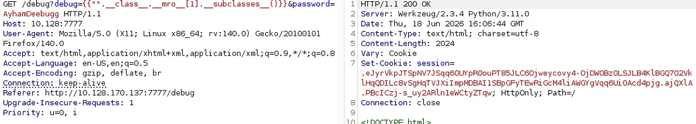

The output contained hundreds of loaded Python classes.

---

## Why Enumeration is Useful

Enumeration identifies:

* subprocess
* os
* warnings
* file handlers
* import mechanisms
* networking libraries

These objects become possible execution primitives.

---

## Runtime Enumeration Benefits

Instead of relying on version-specific payloads, attackers inspect the current interpreter state.

Advantages include:

* Higher reliability.
* Better portability.
* Environment awareness.

---

## Blue Team Perspective

Repeated runtime enumeration often appears as:

* Very large template responses.
* Class list output.
* Unexpected internal Python object names.

These requests are highly suspicious.

---

# 1️⃣6️⃣ Discovering the Command Execution Primitive

Enumeration alone is insufficient.

The next task is locating an object capable of executing operating system commands.

---

## 16.1 Identifying Execution Objects

The runtime output was searched locally to identify a process execution class.

### Screenshot — subprocess Discovery

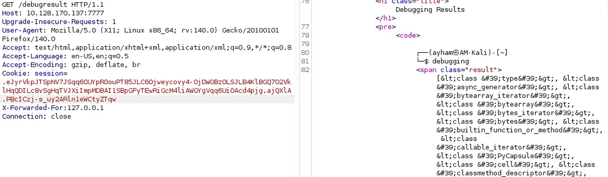

The relevant execution primitive appeared inside the loaded runtime.

---

## Why This Object Matters

Python's process execution interfaces allow:

* Shell command execution.
* Command output retrieval.
* Process spawning.
* Reverse shell execution.

The exact runtime index varies between executions.

Therefore enumeration should always be performed dynamically.

---

## Security Insight

The attack does **not** exploit Python itself.

The exploit abuses:

* SSTI,
* unrestricted template evaluation,
* runtime introspection.

---

## Safer Application Design

Applications should isolate templates from interpreter internals.

---

# 1️⃣7️⃣ Remote Code Execution (RCE)

With a valid execution primitive identified, template execution became operating system command execution.

This represents the transition from application compromise to operating system compromise.

---

## 17.1 RCE Validation

A harmless operating system command confirmed execution.

Successful output demonstrated:

* shell execution,
* process creation,
* response capture.

---

## RCE Attack Flow

```text id="up0nmd"
SSTI
 │
 ▼
Python Runtime
 │
 ▼
Process Execution
 │
 ▼
Operating System Command
 │
 ▼
HTTP Response
```

---

## Why This Is High Severity

Remote Code Execution typically allows attackers to:

* Execute arbitrary commands.
* Read sensitive files.
* Download malware.
* Establish persistence.
* Escalate privileges.

---

## CWE Classification

This vulnerability aligns with:

* **CWE-94**
* Code Injection

and is commonly categorized as **Critical**.

---

## Defensive Recommendation

* Disable template execution for user-controlled input.
* Sandbox templates.
* Remove dangerous globals.
* Restrict interpreter access.

---

# 1️⃣8️⃣ Reverse Shell Preparation

Executing commands through HTTP quickly becomes inefficient.

An interactive shell provides a far better post-exploitation environment.

---

## 18.1 Payload Preparation

Because certain shell metacharacters were filtered, the command required encoding before delivery.

### Screenshot — Encoded Payload Preparation

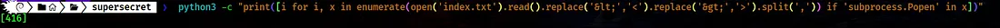

Encoding avoids transmission issues while preserving payload integrity.

---

## Why Encoding Was Necessary

The application rejected specific characters commonly found in shell payloads.

Encoding transformed the payload into a transport-safe format.

The server reconstructed it before execution.

---

## Security Lesson

Input filtering alone is **not** an effective defense.

Attackers routinely encode payloads using:

* Base64.
* URL Encoding.
* Hex Encoding.
* Unicode Encoding.

Filtering must be combined with proper validation and secure execution design.

---

## 18.2 Delivering the Payload

The encoded payload was URL-encoded before submission through Burp Suite.

### Screenshot — URL Encoded Payload

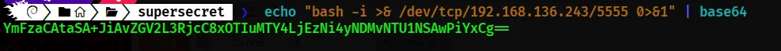

This ensured the HTTP request reached the application without corruption.

---

## Listener Preparation

A listener was prepared on the attacker machine before triggering execution.

This listener awaited an inbound shell connection.

---

## 18.3 Interactive Shell Established

After triggering the template execution endpoint, the application connected back to the listener.

### Screenshot — Initial Reverse Shell

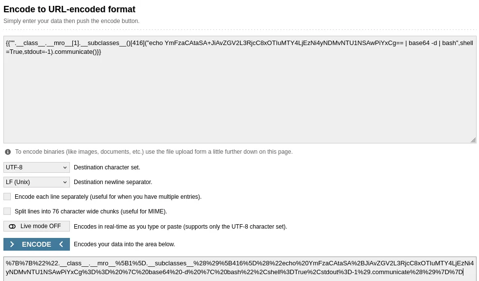

The attacker obtained an interactive Linux shell running as the application's user.

---

## Shell Verification

The shell confirmed:

* current user,
* working directory,
* filesystem access,
* command execution capability.

Challenge output is intentionally omitted.

```text id="hga8ml"
FLAG_REDACTED
```

---

## Post-Exploitation Objectives

With shell access established, the next priorities became:

1. Stabilize the shell.
2. Enumerate users.
3. Enumerate processes.
4. Enumerate cron jobs.
5. Identify writable files.
6. Search for privilege escalation opportunities.

---

## Security Impact Summary

<table>
<tr>
<th>Finding</th>
<th>Risk</th>
</tr>

<tr>
<td>Trusted forwarded header</td>
<td>Authorization boundary bypass.</td>
</tr>

<tr>
<td>Jinja template execution</td>
<td>Server-Side Template Injection.</td>
</tr>

<tr>
<td>Runtime introspection</td>
<td>Python internals exposed.</td>
</tr>

<tr>
<td>Process execution primitive</td>
<td>Remote Code Execution.</td>
</tr>

<tr>
<td>Interactive reverse shell</td>
<td>Complete compromise of application context.</td>
</tr>

</table>

---


# Security Lessons Learned---

# 1️⃣9️⃣ Phase Three — Linux Enumeration & Privilege Escalation

After achieving an interactive shell through Server-Side Template Injection, the attack transitioned from **web application exploitation** to **Linux privilege escalation**.

The goal of this phase is to enumerate the operating system, identify privilege escalation opportunities, and analyze scheduled tasks running under higher-privileged accounts.

Unlike the previous phase, exploitation now relies on Linux permissions, environment configuration, and cron job behavior rather than application vulnerabilities.

---

## 19.1 Post-Exploitation Enumeration Strategy

Immediately after obtaining shell access, a structured enumeration process was followed.

### Enumeration Checklist

| Enumeration Target    | Purpose                                  |
| --------------------- | ---------------------------------------- |
| Current user          | Identify execution context.              |
| User home directories | Search for accessible files.             |
| Running processes     | Detect scheduled tasks and services.     |
| Cron jobs             | Identify recurring privileged commands.  |
| Writable files        | Search for privilege escalation vectors. |
| Environment variables | Identify PATH or credential leakage.     |

---

### Why Enumeration Comes First

Privilege escalation should never begin by guessing exploits.

Instead, enumerate:

* permissions,
* scheduled jobs,
* writable configuration files,
* service ownership,
* environment inheritance.

This approach is repeatable across real penetration tests.

---

# 2️⃣0️⃣ Process & Cron Job Enumeration

One of the first enumeration activities involved monitoring processes executing on the target machine.

The room intentionally uses scheduled jobs as the privilege escalation vector.

---

## 20.1 Monitoring Running Processes

A lightweight process monitoring utility was executed to observe recurring tasks.

### Screenshot — Cron Observation

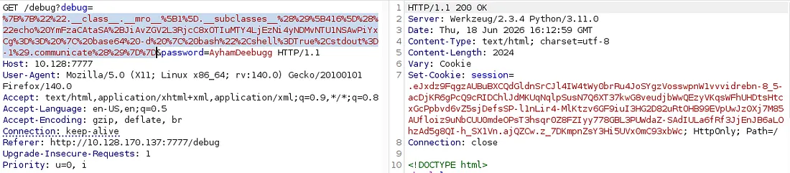

---

## Findings

Two recurring jobs appeared.

| User Context   | Observation                                 |
| -------------- | ------------------------------------------- |
| Secondary user | Login shell executed periodically.          |
| Root           | Scheduled curl command executed repeatedly. |

---

## Why This Was Important

Cron jobs execute automatically.

If a privileged cron job interacts with attacker-controlled resources, it becomes a potential escalation vector.

---

## Scheduled Task Analysis

The monitoring output revealed that one scheduled task launched Bash with the **login shell option** enabled.

### Login Shell Behavior

```text id="nm8ph4"
Cron
 │
 ▼
bash -l
 │
 ▼
Read .profile
 │
 ▼
Load PATH
 │
 ▼
Execute Scheduled Command
```

---

## Security Observation

The `-l` (login shell) option changes security behavior.

A login shell reads initialization files including:

* `.profile`
* `.bash_profile`
* `.bash_login`

This creates an opportunity if those files are writable.

---

## Blue Team Detection Opportunity

Monitor for:

* Cron launching login shells.
* Unexpected `.profile` modifications.
* PATH changes before scheduled execution.

---

# 2️⃣1️⃣ Writable `.profile` Discovery

After identifying the login shell, filesystem permissions became the next focus.

---

## 21.1 Permission Enumeration

The target user's shell initialization file was inspected.

### Screenshot — Writable Profile


---

## Finding

The `.profile` file belonging to another user was writable from the compromised account.

This represents a serious privilege boundary failure.

---

## Why `.profile` Matters

`.profile` executes automatically whenever Bash starts as a login shell.

It commonly configures:

* PATH
* Environment variables
* Aliases
* Startup commands

---

## Attack Opportunity

If an attacker controls PATH, they influence how commands resolve.

### PATH Resolution

```text id="h7h6kj"
PATH
 │
 ▼
Directory 1
 │
 ▼
Directory 2
 │
 ▼
Directory 3
 │
 ▼
System Binary
```

The first matching executable is launched.

---

## Security Risk

Writable initialization files allow attackers to:

* modify environment variables,
* prepend malicious directories,
* execute arbitrary binaries during privileged startup.

---

## Defensive Recommendation

* Home directories should enforce correct ownership.
* `.profile` permissions should be restricted.
* Privileged scheduled jobs should avoid login shells whenever possible.

---

# 2️⃣2️⃣ PATH Hijacking — Lateral Movement

This stage demonstrates one of the most valuable Linux privilege escalation techniques in the room.

---

## 22.1 Understanding PATH Hijacking

Linux searches executables in the order specified by the PATH environment variable.

If an attacker-controlled directory appears before system directories, malicious binaries execute first.

---

## PATH Search Example

```text id="nni72l"
PATH=/home/user/bin:/usr/local/bin:/usr/bin:/bin

Command: cat

Search Order

/home/user/bin/cat
/usr/local/bin/cat
/usr/bin/cat
/bin/cat
```

The first executable wins.

---

## Why This Worked

The scheduled job called a binary **without using an absolute path**.

Instead of `/bin/cat`, it executed `cat`.

This allowed PATH manipulation.

---

## 22.2 Preparing the Malicious Binary

A controlled executable was created inside an attacker-controlled directory.

### Screenshot — Fake Binary Creation


---

## Attack Workflow

```text id="j8wj3b"
Writable .profile
       │
       ▼
PATH Modified
       │
       ▼
Cron Executes "cat"
       │
       ▼
Attacker Binary Executes
       │
       ▼
Second User Shell
```

---

## Why This Technique Is Powerful

No kernel exploit.

No SUID binary.

No password cracking.

Only environment inheritance and PATH resolution.

---

## Security Lesson

Always execute binaries with **absolute paths** inside:

* cron jobs,
* systemd services,
* automation scripts,
* privileged maintenance jobs.

---

## Detection Opportunity

Indicators include:

* Unexpected executable inside user-owned `bin`.
* PATH modifications.
* Privileged processes launching binaries outside system directories.

---

# 2️⃣3️⃣ Lateral Movement Completed

After the scheduled task executed, shell context transitioned into another user account.

---

## User Transition

The attack gained access to a second Linux user.

Capabilities increased through:

* additional filesystem access,
* new writable files,
* new scheduled tasks.

---

## Why This Matters

Privilege escalation frequently occurs in **multiple stages**.

Initial compromise rarely jumps directly to root.

Instead:

```text id="q8iz4w"
Web Application
      │
      ▼
Application User
      │
      ▼
Second Linux User
      │
      ▼
Root
```

---

## Post-Lateral Enumeration

The new account was inspected for:

* writable cron configuration,
* root-owned scheduled tasks,
* sensitive files.

---

# 2️⃣4️⃣ Root Privilege Escalation — Cron Configuration Abuse

The second scheduled task became the final escalation vector.

---

## 24.1 Root Cron Analysis

Process monitoring showed a root cron job invoking **curl** with a configuration file.

### Screenshot — Root Cron Configuration

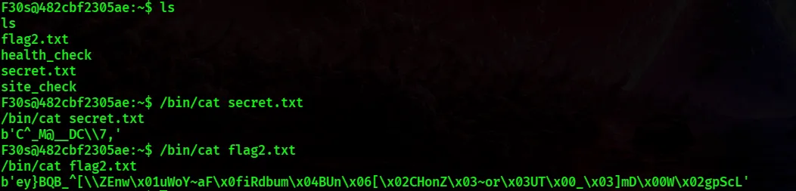

---

## Why `curl -K` Matters

`curl -K` tells curl to read options from a configuration file.

Example capabilities include:

* URL
* Headers
* Authentication
* Output location
* Proxy
* File operations

---

## Security Issue

The configuration file consumed by root was writable.

This violated a critical security principle:

> **Privileged processes must never consume attacker-controlled configuration.**

---

## Root Cron Workflow

```text id="cwvkgi"
Root Cron
    │
    ▼
curl -K config
    │
    ▼
Read Config File
    │
    ▼
Execute Options
    │
    ▼
Write Output As Root
```

---

## Impact Analysis

An attacker gains control over:

* resource curl reads,
* destination path,
* output behavior.

This effectively becomes a **root-context file read primitive**.

---

## Security Severity

This is equivalent to allowing a privileged process to execute attacker-supplied runtime configuration.

Potential impacts include:

* reading protected files,
* overwriting writable targets,
* information disclosure.

---

## Defensive Recommendation

Configuration files should be:

* owned by root,
* non-writable,
* validated before execution.

---

# 2️⃣5️⃣ Root-Level File Access

The writable curl configuration was modified to instruct curl to access local files.

---

## Privilege Escalation Logic

```text id="n3vswy"
Writable Config
      │
      ▼
Root Executes curl
      │
      ▼
Reads Local File
      │
      ▼
Writes Output
      │
      ▼
Attacker Reads File
```

---

## Why Local File URIs Matter

Curl supports multiple URI schemes.

The room abuses a **local file URI** through configuration.

The important security lesson is not curl itself.

The lesson is **trusting attacker-controlled configuration**.

---

## Screenshot — Final Root Evidence


---

## Result

The scheduled task wrote privileged data into an attacker-accessible location.

Challenge output has been removed.

```text id="x8m29r"
FLAG_REDACTED
```

---

## Root Context Achieved

The attack chain successfully transitioned from:

* web application,
* application user,
* second Linux user,
* root execution context.

---

# 2️⃣6️⃣ Privilege Escalation Timeline

## Complete Linux Escalation Flow

```text id="x0kpn1"
Initial Shell
     │
     ▼
Process Enumeration
     │
     ▼
Cron Discovery
     │
     ▼
Writable .profile
     │
     ▼
PATH Hijacking
     │
     ▼
Second User Shell
     │
     ▼
Root Cron Analysis
     │
     ▼
Writable curl Config
     │
     ▼
Root-Level File Access
     │
     ▼
Root Shell Context
```

---

## Security Perspective

No kernel vulnerabilities.

No buffer overflow.

No SUID exploit.

Only configuration mistakes chained together.

This mirrors many real-world privilege escalation scenarios.

---

# 2️⃣7️⃣ Vulnerability Summary

<table>
<tr>
<th>Finding</th>
<th>Severity</th>
<th>Category</th>
</tr>

<tr>
<td>Source Code Disclosure</td>
<td>High</td>
<td>Information Disclosure</td>
</tr>

<tr>
<td>Weak XOR Authentication</td>
<td>Medium</td>
<td>Cryptographic Weakness</td>
</tr>

<tr>
<td>Forwarded Header Trust</td>
<td>High</td>
<td>Authorization Bypass</td>
</tr>

<tr>
<td>Server-Side Template Injection</td>
<td>Critical</td>
<td>Remote Code Execution</td>
</tr>

<tr>
<td>Writable `.profile`</td>
<td>High</td>
<td>Privilege Escalation</td>
</tr>

<tr>
<td>PATH Hijacking</td>
<td>High</td>
<td>Privilege Escalation</td>
</tr>

<tr>
<td>Writable curl Configuration</td>
<td>Critical</td>
<td>Privilege Escalation</td>
</tr>

</table>

---

# 2️⃣8️⃣ Defensive Recommendations

## Web Layer

* Remove development endpoints.
* Disable debug mode.
* Prevent source disclosure.
* Replace XOR with secure password hashing.
* Validate template input.

---

## Application Layer

* Do not trust forwarded headers.
* Restrict template globals.
* Escape user-controlled content.

---

## Linux Layer

* Use absolute executable paths.
* Restrict `.profile` ownership.
* Audit writable startup files.
* Monitor cron integrity.

---

## Detection Opportunities

Security teams should monitor for:

| Indicator                   | Detection Strategy        |
| --------------------------- | ------------------------- |
| Requests for source files   | Web logs                  |
| SSTI syntax (`{{ }}`)       | WAF / IDS                 |
| Runtime class enumeration   | Application logs          |
| Shell spawned from Python   | EDR                       |
| `.profile` modification     | File Integrity Monitoring |
| PATH changes                | Auditd                    |
| Writable cron configuration | Permission auditing       |

---

# Key Lessons Learned

* Scheduled tasks frequently become privilege escalation vectors.
* Login shells inherit attacker-controlled environment configuration.
* PATH hijacking is effective whenever privileged processes execute commands without absolute paths.
* Configuration files consumed by privileged processes must never be writable by lower-privileged users.
* Multiple medium-severity misconfigurations can chain into a complete root compromise.

---

---

# 2️⃣9️⃣ MITRE ATT&CK Mapping

This room demonstrates multiple stages of the MITRE ATT&CK framework. While the environment is intentionally vulnerable for training purposes, mapping techniques to ATT&CK helps translate CTF experience into real-world security operations knowledge.

---

## ATT&CK Technique Mapping

| Attack Phase                      | MITRE ATT&CK Technique | Description                                                         |
| --------------------------------- | ---------------------- | ------------------------------------------------------------------- |
| Service Discovery                 | **T1046**              | Network service discovery using port scanning.                      |
| File Discovery                    | **T1083**              | Enumeration of exposed files and directories.                       |
| Exploit Public-Facing Application | **T1190**              | Exploitation of vulnerable Flask application.                       |
| Exploitation for Client Execution | **T1203**              | Abuse of server-side template evaluation.                           |
| Command Execution                 | **T1059**              | Command execution through Python runtime.                           |
| Process Discovery                 | **T1057**              | Monitoring running processes and cron jobs.                         |
| Scheduled Task Discovery          | **T1053**              | Identifying recurring cron jobs.                                    |
| Path Interception                 | **T1574.007**          | PATH hijacking through writable environment configuration.          |
| Data From Local System            | **T1005**              | Reading files from privileged execution context.                    |
| Valid Accounts (Lab Context)      | **T1078**              | Access obtained after recovering application authentication secret. |

---

## ATT&CK Kill Chain Visualization

```text id="twz6m8"
Reconnaissance
      │
      ▼
Network Discovery
      │
      ▼
Web Enumeration
      │
      ▼
Application Exploitation
      │
      ▼
Command Execution
      │
      ▼
Privilege Escalation
      │
      ▼
Root-Level Access
```

---

## Why ATT&CK Mapping Matters

Understanding ATT&CK provides security professionals with a common language for:

* Threat Hunting
* Detection Engineering
* SOC Playbooks
* Incident Response
* Purple Team Exercises

The techniques demonstrated in this room frequently appear in web application intrusion investigations.

---

# 3️⃣0️⃣ Blue Team Detection Opportunities

Every offensive technique leaves observable artifacts.

This section discusses how defenders could detect or investigate similar activity.

---

## Detection Strategy Overview

<table>
<tr>
<th>Attack Stage</th>
<th>Defensive Signal</th>
</tr>

<tr>
<td>Directory Enumeration</td>
<td>High volume requests returning 404/403 responses.</td>
</tr>

<tr>
<td>Source Download Attempts</td>
<td>Requests for application source files.</td>
</tr>

<tr>
<td>Debug Authentication</td>
<td>Access to internal debugging endpoints.</td>
</tr>

<tr>
<td>SSTI Payloads</td>
<td>Jinja syntax appearing in HTTP requests.</td>
</tr>

<tr>
<td>Python Runtime Enumeration</td>
<td>Responses containing Python class hierarchy.</td>
</tr>

<tr>
<td>Command Execution</td>
<td>Python spawning shell processes.</td>
</tr>

<tr>
<td>Reverse Shell</td>
<td>Unexpected outbound TCP connection.</td>
</tr>

<tr>
<td>PATH Hijacking</td>
<td>Executable launched from user-controlled directory.</td>
</tr>

<tr>
<td>Cron Abuse</td>
<td>Root process reading writable configuration.</td>
</tr>

</table>

---

## 30.1 Web Server Indicators

### Suspicious HTTP Requests

Examples include:

* unusual directory enumeration,
* repeated access to `/debug`,
* requests containing template syntax,
* requests attempting file downloads.

### Monitoring Recommendations

* Nginx access logs.
* Reverse proxy logs.
* WAF request inspection.
* HTTP anomaly detection.

---

## 30.2 Template Injection Indicators

Watch for requests containing:

```text id="yrvfvd"
{{ }}

__class__
__mro__
subclasses
```

These strings rarely appear in legitimate user traffic.

---

## Recommended Detection Rule

* Alert when template syntax appears inside user parameters.
* Alert on multiple template syntax attempts within one session.

---

## 30.3 Reverse Shell Indicators

Potential artifacts include:

| Indicator                      | Source             |
| ------------------------------ | ------------------ |
| Python spawning `/bin/sh`      | EDR                |
| Outbound connection from Flask | Network monitoring |
| Netcat listener connection     | Firewall logs      |
| Unexpected child processes     | Sysmon / Auditd    |

---

## 30.4 File Integrity Monitoring

Critical files to monitor:

| File                     | Reason                       |
| ------------------------ | ---------------------------- |
| `.profile`               | PATH manipulation.           |
| `.bashrc`                | Environment persistence.     |
| `/etc/crontab`           | Scheduled task abuse.        |
| User cron directories    | Privileged automation.       |
| curl configuration files | Runtime option manipulation. |

---

## 30.5 Detection Engineering Ideas

SOC teams could create detections for:

* Web process launching shell.
* PATH modified during cron execution.
* Root process reading non-root-owned configuration.
* Frequent HTTP requests containing Jinja expressions.

---

# 3️⃣1️⃣ Security Hardening Recommendations

This section maps each vulnerability to a practical defensive recommendation.

---

## 31.1 Source Code Protection

### Issue

Application source was downloadable.

### Risk

* Secret disclosure.
* Hidden route discovery.
* Authentication logic exposure.

### Recommendation

* Store source outside downloadable directories.
* Implement allowlists.
* Canonicalize requested paths.
* Disable directory traversal.

---

## 31.2 Authentication Security

### Issue

Password protected using reversible XOR.

### Recommendation

Use:

* Argon2id
* bcrypt
* scrypt

Never store passwords using reversible encryption.

---

## 31.3 Flask Debug Security

### Issue

Debug functionality accessible externally.

### Recommendation

* Disable debug mode.
* Remove debug endpoints.
* Restrict internal tooling.
* Protect developer routes behind authentication.

---

## 31.4 Jinja Security

### Issue

Template rendered attacker-controlled input.

### Recommendation

* Use trusted templates only.
* Escape user content.
* Never render template source from HTTP parameters.
* Sandbox template environment where appropriate.

---

## 31.5 Header Trust

### Issue

Application trusted forwarded headers directly.

### Recommendation

* Trust headers only from reverse proxy.
* Strip external forwarded headers.
* Validate client IP separately.

---

## 31.6 Linux Environment Security

### Issue

Writable shell initialization file.

### Recommendation

* Correct ownership.
* Remove world/group write permissions.
* Avoid login shells in cron unless required.

---

## 31.7 Scheduled Task Security

### Issue

Root cron consumed attacker-controlled curl configuration.

### Recommendation

* Root-owned configuration.
* Read-only permissions.
* Absolute paths.
* Configuration validation.

---

## Defense-in-Depth Summary

<table>
<tr>
<th>Layer</th>
<th>Recommendation</th>
</tr>

<tr>
<td>Application</td>
<td>Remove debug features, validate downloads.</td>
</tr>

<tr>
<td>Authentication</td>
<td>Use adaptive password hashing.</td>
</tr>

<tr>
<td>Template Engine</td>
<td>Never evaluate untrusted templates.</td>
</tr>

<tr>
<td>Operating System</td>
<td>Protect startup files and cron jobs.</td>
</tr>

<tr>
<td>Monitoring</td>
<td>Detect template injection, shell spawning, cron abuse.</td>
</tr>

</table>

---

# 3️⃣2️⃣ Vulnerability Root Cause Analysis

Rather than treating each issue independently, this room demonstrates a chain of trust failures.

---

## Root Cause Table

| Vulnerability        | Root Cause                                          |
| -------------------- | --------------------------------------------------- |
| Source Disclosure    | Insecure download validation.                       |
| Weak Cryptography    | Custom reversible XOR implementation.               |
| Authorization Bypass | Client-controlled trust boundary.                   |
| SSTI                 | Unsafe template rendering.                          |
| PATH Hijacking       | Writable environment initialization.                |
| Cron Abuse           | Privileged process consumed writable configuration. |

---

## Chained Security Failure

```text id="jwdhhd"
Information Disclosure
        │
        ▼
Authentication Recovery
        │
        ▼
Authorization Weakness
        │
        ▼
Code Execution
        │
        ▼
Privilege Escalation
        │
        ▼
Root Compromise
```

---

## Security Principle Violations

* Least Privilege
* Trust Boundary Enforcement
* Secure Secret Storage
* Secure Defaults
* Defense in Depth

---

# 3️⃣3️⃣ Lessons Learned

This room teaches several practical penetration testing concepts beyond exploitation.

---

## Offensive Security Lessons

### Reconnaissance Matters

Hidden functionality frequently provides the best attack surface.

### Read the Source

Source disclosure can eliminate guesswork.

### Understand the Framework

Knowing Flask and Jinja makes exploitation significantly easier.

### Enumerate Before Exploiting

Systematic enumeration consistently reveals privilege escalation opportunities.

### Chain Weaknesses

Real attacks often combine medium-severity issues into a critical compromise.

---

## Defensive Security Lessons

### Secure Development

* Remove debugging functionality.
* Validate file access.
* Use proper cryptography.

### Infrastructure Security

* Protect scheduled tasks.
* Restrict writable configuration.
* Monitor environment changes.

### Monitoring

Every offensive step leaves telemetry.

---

## Personal Learning Outcomes

This room strengthened practical understanding of:

* Flask application assessment.
* Jinja2 internals.
* Python runtime introspection.
* Linux privilege escalation.
* Cron abuse.
* Security reporting.

---

# 3️⃣4️⃣ Technical Skills Demonstrated

## Web Security

* Flask Enumeration
* HTTP Request Manipulation
* Burp Suite Repeater
* Source Code Review
* SSTI Discovery
* Runtime Enumeration

---

## Linux Security

* User Enumeration
* Process Monitoring
* Cron Enumeration
* Writable File Discovery
* PATH Hijacking
* Privilege Escalation Analysis

---

## Security Engineering

* Vulnerability Analysis
* Root Cause Analysis
* MITRE ATT&CK Mapping
* Detection Opportunities
* Security Hardening Recommendations

---

# 3️⃣5️⃣ Evidence Gallery

All screenshots used throughout this report are stored inside:

```text id="1iw0rr"
docs/assets/
```

---

## Screenshot Index

| Screenshot                      | Description                                           |
| ------------------------------- | ----------------------------------------------------- |
| `00_room_banner.png`            | TryHackMe room banner.                                |
| `01_port_scan.png`              | Initial Nmap service enumeration.                     |
| `02_content_discovery.png`      | FFUF directory discovery results.                     |
| `03_cloud_source_request.png`   | Source code retrieval through `/cloud`.               |
| `04_secret_tip_download.png`    | Downloaded encrypted secret file.                     |
| `05_xor_decryption.png`         | XOR password reconstruction.                          |
| `06_debug_source_request.png`   | Debug helper source analysis.                         |
| `07_ssti_confirmation.png`      | Server-Side Template Injection validation.            |
| `08_debugresult_cookie.png`     | Authenticated debug session request.                  |
| `09_ssti_class_enumeration.png` | Python runtime class enumeration.                     |
| `10_popen_index.png`            | Runtime discovery of execution primitive.             |
| `11_base64_shell.png`           | Reverse shell payload preparation.                    |
| `12_payload_encoded.png`        | URL-encoded payload delivery.                         |
| `13_reverse_shell.png`          | Initial interactive Linux shell.                      |
| `14_cron_observation.png`       | Cron job monitoring and process discovery.            |
| `15_profile_writable.png`       | Writable `.profile` permission analysis.              |
| `16_fake_cat_payload.png`       | PATH hijacking payload creation.                      |
| `17_root_curl_cron.png`         | Root cron configuration analysis.                     |
| `18_flags_terminal.png`         | Final privilege escalation evidence (flags redacted). |

---

# 3️⃣6️⃣ References

## Official Resources

* TryHackMe — SuperSecretTip Room
* Flask Documentation
* Jinja2 Documentation
* Python Documentation
* MITRE ATT&CK Framework

---

## Security References

* OWASP Top 10
* CWE-94 — Code Injection
* CWE-639 — Authorization Weaknesses
* CWE-552 — Information Exposure Through Files
* MITRE ATT&CK Enterprise Matrix

---

# 3️⃣7️⃣ Conclusion

SuperSecretTip demonstrates how **multiple independent security weaknesses can be chained into a complete system compromise**.

The engagement began with a seemingly harmless Flask application exposed through a Werkzeug development server. Through systematic reconnaissance and source code analysis, hidden functionality was discovered, authentication logic was reconstructed, and Server-Side Template Injection provided Remote Code Execution.

Post-exploitation shifted to Linux privilege escalation, where writable environment configuration and insecure scheduled tasks enabled lateral movement and root-level access without exploiting the kernel or using password attacks.

---

## Final Attack Chain Summary

```text id="spnp1b"
Reconnaissance
      │
      ▼
Directory Enumeration
      │
      ▼
Source Code Disclosure
      │
      ▼
XOR Secret Reconstruction
      │
      ▼
Debug Authentication
      │
      ▼
Server-Side Template Injection
      │
      ▼
Remote Code Execution
      │
      ▼
Initial Shell
      │
      ▼
Cron Enumeration
      │
      ▼
Writable .profile
      │
      ▼
PATH Hijacking
      │
      ▼
Second User Access
      │
      ▼
Root Cron Abuse
      │
      ▼
Root-Level File Access
```

---

## Security Takeaways

* Information disclosure frequently becomes the first step toward deeper compromise.
* Custom cryptographic implementations are rarely secure replacements for industry standards.
* Trust boundaries should never depend on client-controlled metadata.
* Template engines must never evaluate attacker-controlled input.
* Scheduled tasks and environment configuration require strict privilege separation.
* Defense in Depth is essential because attackers routinely chain multiple weaknesses together.

---

## Portfolio Statement

This walkthrough is maintained as part of my **Cybersecurity Portfolio** documenting hands-on offensive security labs completed on **TryHackMe**.

The documentation focuses on:

* Technical methodology.
* Security reasoning.
* Vulnerability analysis.
* Defensive recommendations.
* Professional reporting practices.

**All challenge flags, secrets, session cookies, passwords, API keys, and sensitive values have been intentionally redacted for ethical publication and plagiarism prevention.**

---

<div align="center">

## 🛡️ SuperSecretTip — TryHackMe Walkthrough Complete

**Cybersecurity Portfolio • Offensive Security Documentation • By Anurag R.**

*Thank you for reading.*

</div>


